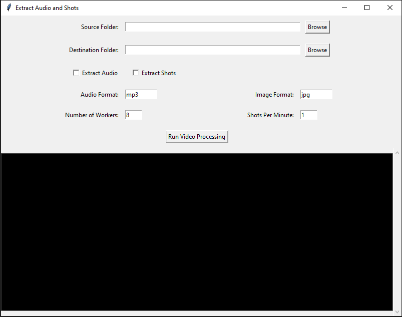

# Extract-Audio-and-Shots

## Brief

This tool is designed to simplify the process of extracting audio and shots from videos using Python. It provides a user-friendly GUI built with Tkinter and utilizes the MoviePy library for video processing tasks. With this tool, users can easily select source and destination folders, choose extraction modes, set output formats, specify the number of shots to extract per minute, and control the number of parallel threads for faster processing.

## Snapshot



## Workflow Explanation

1. **Select Source Folder:** Choose the folder where your input videos are located.
2. **Select Destination Folder:** Specify the folder where you want to save the processed output.
3. **Choose Extraction Modes:** Select whether to extract audio, shots, or both from the videos.
4. **Select Output Formats:** Choose the audio and image output formats (e.g., MP3, WAV, JPEG, PNG).
5. **Set Shot Extraction Parameters:** Specify the number of shots to extract per minute of the video.
6. **Set Number of Workers:** Optionally, adjust the number of simultaneous videos processed for faster processing.
7. **Run Video Processing:** Click the button to start processing the videos based on the chosen settings.

## Setup Instructions

### Using Python Virtual Environment

1. Create a Python virtual environment:
   ```bash
   python -m venv local
   ```
2. Install dependencies:
   ```bash
   .\local\Scripts\pip install moviepy==1.0.3
   ```
3. Run the tool:
   ```bash
   .\local\Scripts\python main.py
   ```

### Using Executables

1. Download the pre-built executable from the releases section.
2. Double-click the executable to run the tool.

## Configuration

- **Audio Output Format:** Choose from MP3, WAV, AAC, etc.
- **Image Output Format:** Select JPG, JPEG, PNG, etc.
- **Number of Shots to Extract:** Set the desired number of shots per minute.
- **Number of Parallel Threads:** Adjust the number of threads for concurrent processing. By default, it's set to the number of available CPU cores.
